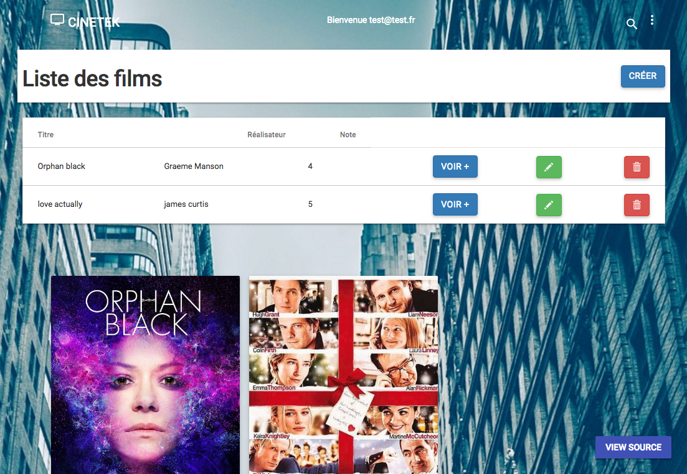

# cinetekAngular

>  An Angular application for viewing all the movies in my cintetek. 



## How it works
Try it with this email and password:
test@test.fr
test

## Installation
Simply run
```
npm install
```
et
```
bower install
```
in the root directory and wait for all the dependencies to install.

Then run 

```
gulp serve
```
to start the server. 

By default the page will be served on <a href="http://localhost:3000">http://localhost:3000</a>.

## Config
Made with love and some other stuff like:  <br />


## Work in progress
The project is in its early stages of development. Some things might not work as intended.

## Known issues
* Social auth doesn't work yet
* have some trouble with my hamburger navbar

## IN PROGRESS...

